# Асинхронный клиент для работы с объектным хранилищем S3-совместимым (Selectel)

Этот проект предоставляет асинхронный клиент для работы с объектным хранилищем, совместимым с S3 API, используя библиотеку `aiobotocore`. Реализованы основные операции, такие как загрузка, скачивание, удаление файлов, получение размера бакета, получение списка файлов и проверка существования файла.  Предназначен для использования с Selectel Object Storage.

## Задание

*   Добавить метод `list_files()`, который будет возвращать список объектов в бакете.
*   Добавить метод `file_exists()`, который должен возвращать булевый ответ на запрос о наличии файла с определенным именем.
*   Настроить bucket policy таким образом, чтобы:
    *   Любой мог читать файлы из определенного бакета.
    *   Только вы могли писать в нее.
*   Включить версионирование в бакете и загрузить файл с одним именем несколько раз, а после скачайте его предыдущую версию.
*   Настроить lifecycle policy таким образом, чтобы через 3 дня объекты автоматически удалялись.

## Решение

## Добавленные методы:

В проекте имеется файл `main_selectel.py` , который содержит в себе асинхронного клиента для работы с Selectel Object Storage. 
Класс `AsyncObjectStorage` предоставляет методы для выполнения основных операций.  
Добавлены методы `list_files` и `file_exists`, которые расширяют функциональность клиента.

*   `list_files()`: Возвращает список всех объектов в бакете.
*   `file_exists(remote_name: str)`:  Проверяет, существует ли файл с указанным именем в бакете.  Возвращает `True`, если файл существует, и `False` в противном случае.

До запуска файла `main_selectel.py` содержимое контейнера объектного хранилища отсутствует.

### До запуска файла `main_selectel.py`

Cодержимое папки проекта в интерпретаторе “PyCharm”:
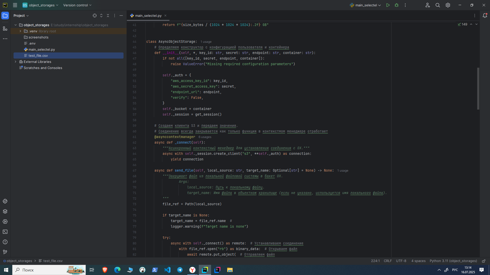

Cодержимое контейнера объектного хранилища:
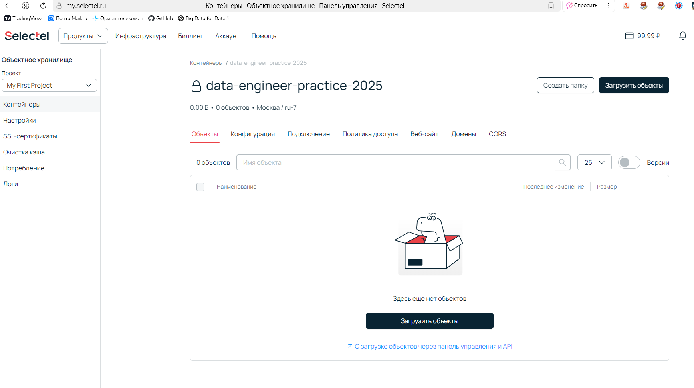 

### После запуска файла `main_selectel.py`

Cодержимое папки проекта в интерпретаторе “PyCharm” и демонстрация работы методов класса:
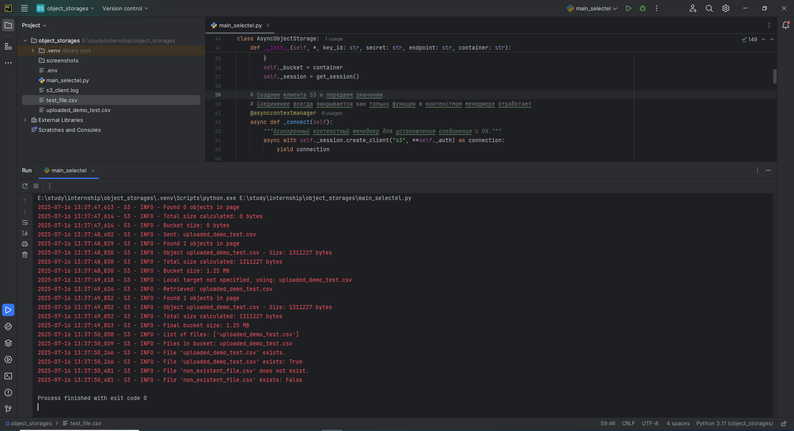 

Cодержимое контейнера объектного хранилища после запуска файла `main_selectel.py`:
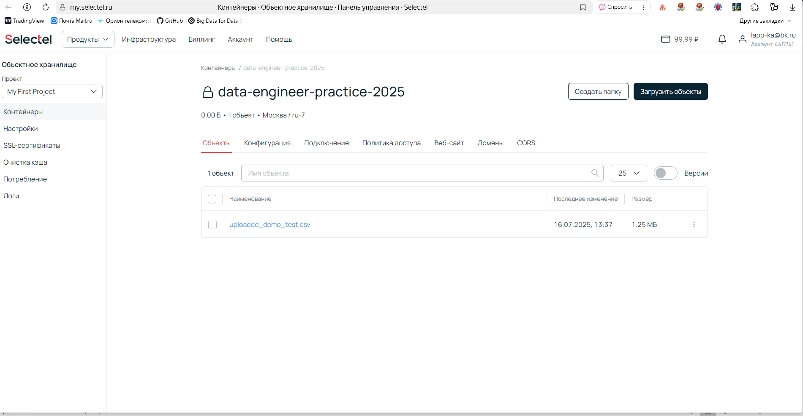

## Настройка Bucket Policy
**Задача:**
*  Разрешить всем читать файлы из определённого бакета.
*  Разрешить только определённому пользователю (вам) записывать файлы в бакет.

**Реализация:**
1.  Созданы сервисные пользователи.
2.  Настроены права записи для сервисного пользователя (администратора) объектного хранилища.  Этому пользователю предоставлены права на запись в контейнер.
3.  Настроены права на чтение для остальных пользователей.  Этим пользователям предоставлено право на чтение из контейнера.

### Демонстрация настройки bucket policy:

Cостав сервисных пользователей:
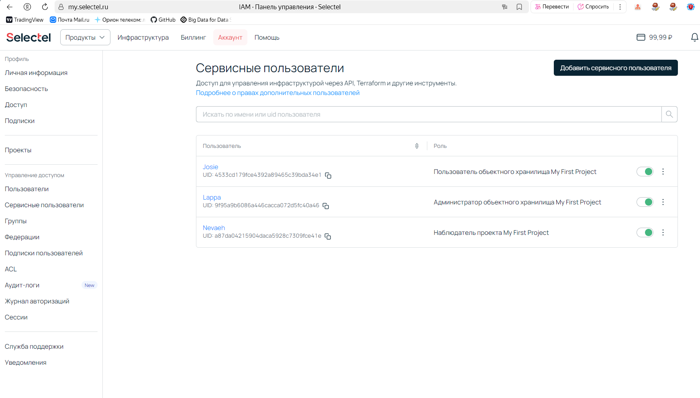

Cписок прав администратора объектного хранилища:
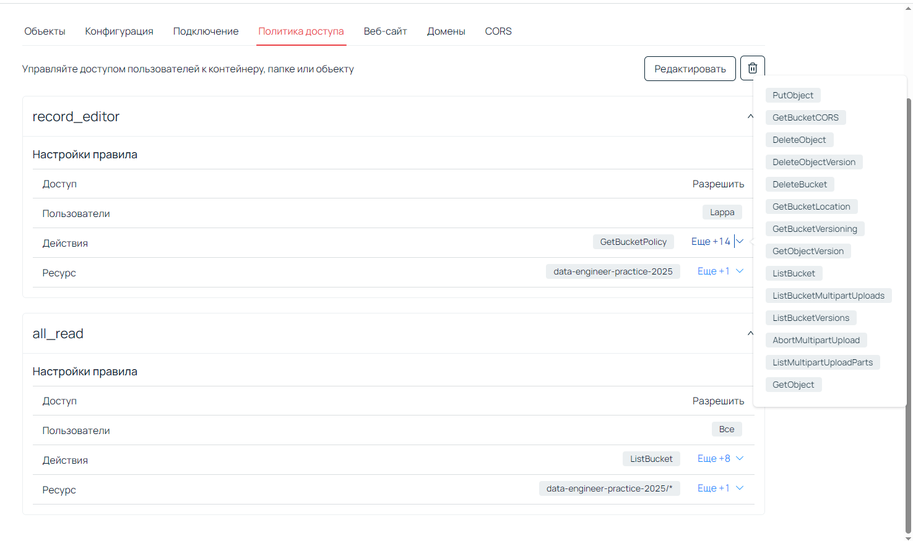

Cписок прав для остальных пользователей:
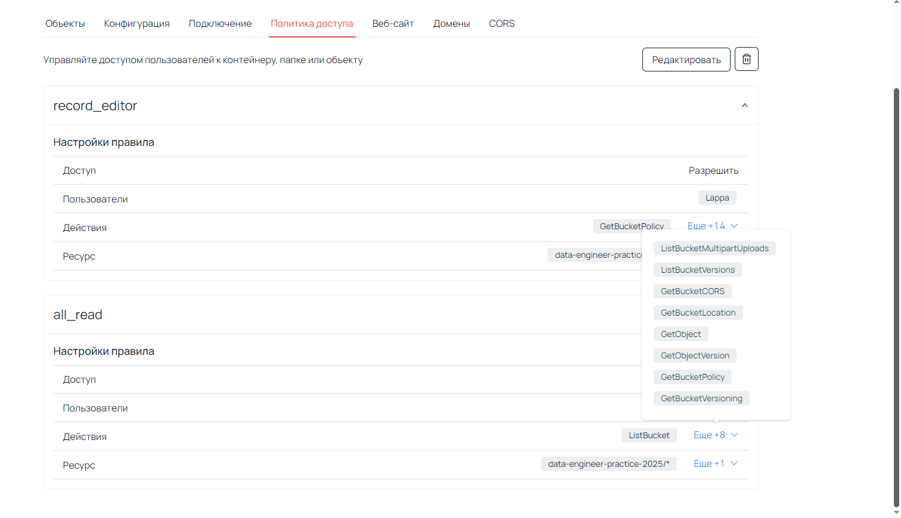

## Включение версионирования
**Задача:**
* Включить версионирование в бакете.
* Загрузить файл с одним именем несколько раз, а после скачать его предыдущую версию.

**Реализация:**
1.  Версионирование включено в бакете.
2.  Загружено несколько версий файла с одним и тем же именем.
3.  Восстановлена предыдущая версия файла.

Для подключения версионирования в бакете в конфигурации контейнера в разделе «Защита данных» - «Версионирование» - выбираем «Включено»
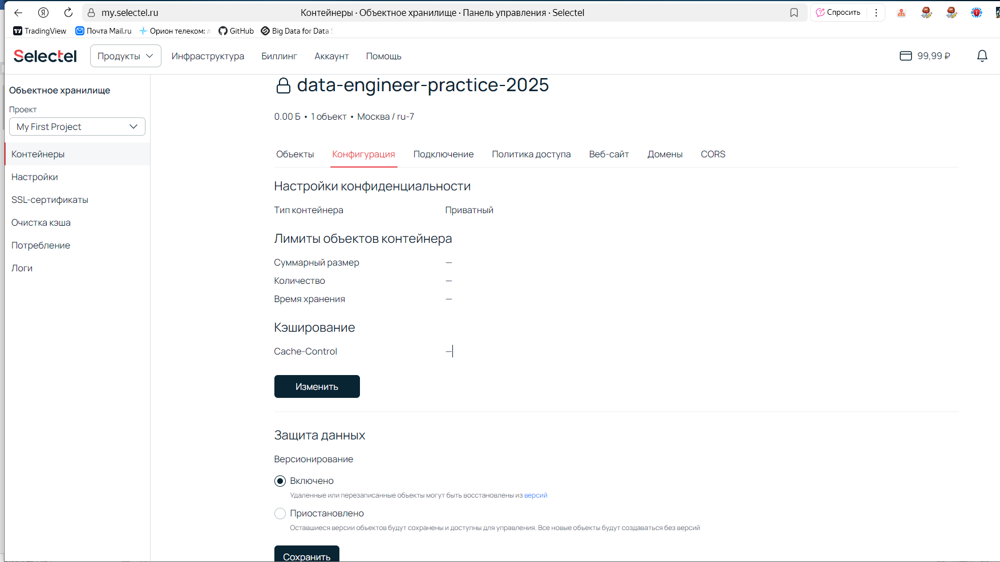

Все версии отличаются между собой по своему ID. Чтобы скачать предыдущую версию объекта, нужно ее сначала восстановить. 
Для этого проваливаемся в объект и выбираем версию для восстановления.

Демонстрация наличия нескольких версий объекта:
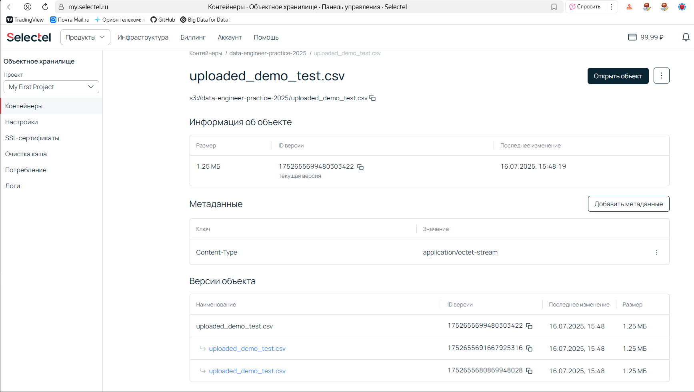

Шаг 1. Выбираем версию для восстановления
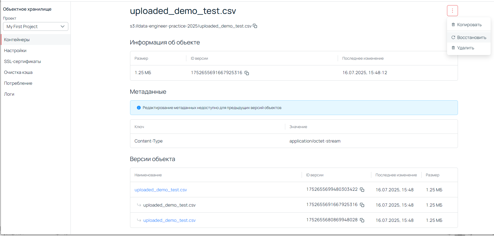

Шаг 2. Подтверждаем восстановление необходимой версии
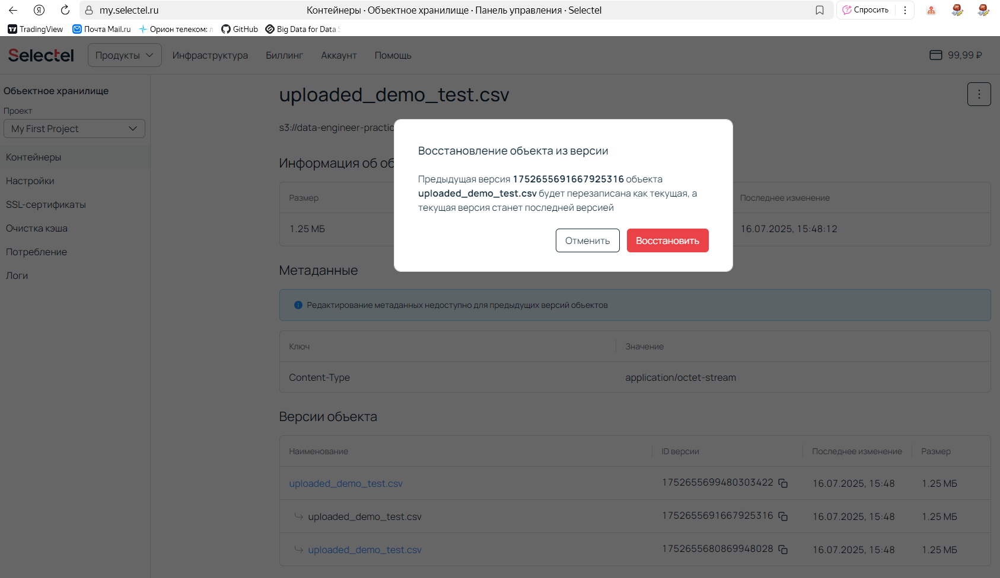

Шаг 3. Получение подтверждения восстановления необходимой версии
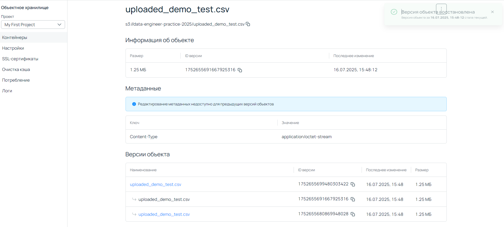

После смены версии объекта можно увидеть, как поменялся ID версии файла на ID выбранной версии.

Выбираем файл с новой версией, нажимаем на три точки в правом верхнем углу окна и выбираем «Скачать»
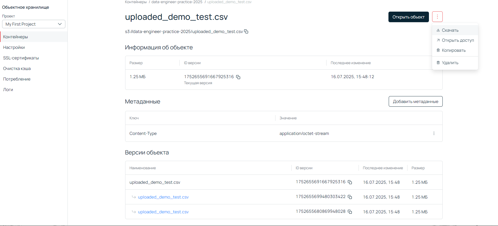

### Настройка Lifecycle Policy
**Задача**
* Настроить lifecycle policy таким образом, чтобы через 3 дня объекты автоматически удалялись.

**Реализация:**

Для настройки lifecycle policy необходимо перейти по следующему пути:

«Контейнеры» - выбрать контейнер - «Конфигурация» - в разделе «Лимиты объектов контейнера» изменить «Время хранения»
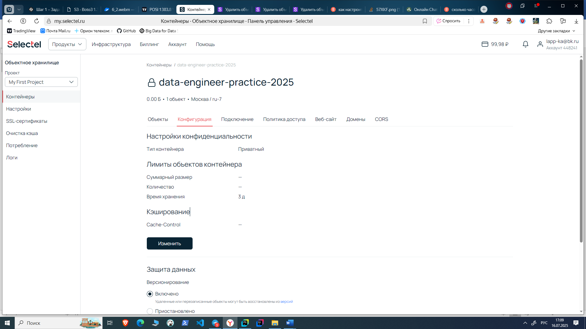

## Описание скриншотов (уточненное)

Папка `screenshots` содержит скриншоты, подтверждающие успешное выполнение задания:

*   [before_the_start_pycharm.png](screenshots/1-before_the_start_pycharm.png) : Содержимое папки проекта до запуска `main_selectel.py`.
*   [before_the_start_selectel.png](screenshots/2-before_the_start_selectel.png): Содержимое контейнера объектного хранилища до запуска `main_selectel.py`.
*   [after_start_pycharm.png](screenshots/3-after_start_pycharm.png):  Содержимое папки проекта и вывод в PyCharm после запуска `main_selectel.py`, демонстрирующий работу методов `list_files` и `file_exists`.
*   [after_start_selectel.png](screenshots/4-after_start_selectel.png):  Содержимое контейнера объектного хранилища после запуска `main_selectel.py`.
*   [project_users.png](screenshots/5-project_users.png): Список пользователей Object Storage.
*   [record_editor.png](screenshots/6-record_editor.png):  Настройка прав для администратора Object Storage (сервисного пользователя).
*   [all_read.png](screenshots/7-all_read.png): Настройка прав на чтение для всех.
*   [versioning_is_enabled.png](screenshots/8-versioning_is_enabled.png): Включение версионирования в бакете в конфигурации контейнера в разделе «Защита данных».
*   [version_object.png](screenshots/9-version_object.png):  Демонстрация наличия нескольких версий объекта.
*   [recovery_step1.png](screenshots/10-recovery_step1.png): Выбор версии объекта для восстановления.
*   [recovery_step2.png](screenshots/11-recovery_step2.png): Подтверждение восстановления выбранной версии.
*   [recovery_step3.png](screenshots/12-recovery_step3.png): Подтверждение восстановления необходимой версии.
*   [new_version_object.png](screenshots/13-new_version_object.png):  Текущая версия объекта после восстановления предыдущей версии.
*   [lifecycle_policy.png](screenshots/14-lifecycle_policy.png): Настройка lifecycle policy (время хранения объектов).

## Запуск

Для запуска демонстрации используется файл [main_selectel.py](main_selectel.py).

## Архитектура проекта

<pre>
.
├── main_selectel.py              # Основной файл (содержит класс и функцию demo)
├── test_file.csv                 # Файл для копирования в объектное хранилище
├── .env                          # Секретный файл с ключами от объектного хранилища
├── uploaded_demo_test.csv        # Файл скачанный с объектного хранилища
├── s3_client.log                 # Файл с логами
├── README                       
└── screenshots                   # Папка с фото-демонстрацией экрана
    ├── 1. before_the_start_pycharm.png
    ├── 2. before_the_start_selectel.png
    ├── 3. after_start_pycharm.png
    ├── 4. after_start_selectel.png
    ├── 5. project_users.png
    ├── 6. record_editor.png
    ├── 7. all_read.png
    ├── 8. versioning_is_enabled.png
    ├── 9. version_object.png
    ├── 10. recovery_step1.png
    ├── 11. recovery_step2.png
    ├── 12. recovery_step3.png
    ├── 13. new_version_object.png
    └── 14. lifecycle_policy.png
</pre>

Выполнила: Катерина Лаппа
